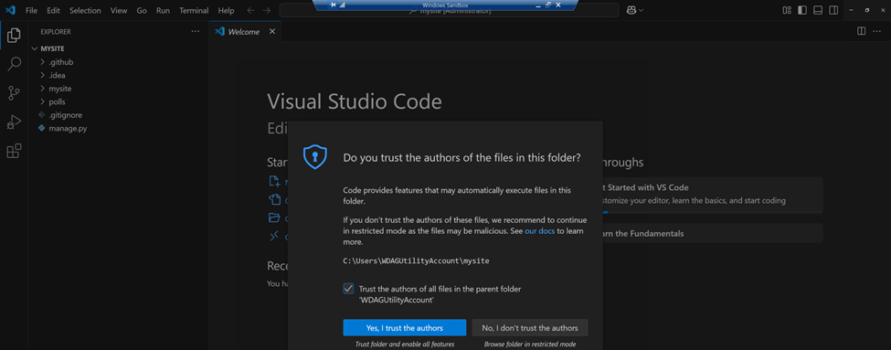
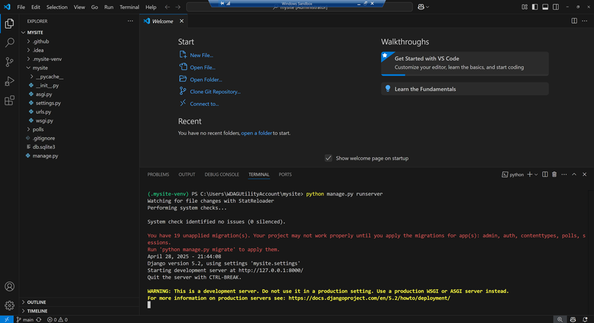

# Installation

## Before you start:
1. This is an instruction for Windows operating system only using a Windows Sandbox virtual machine.
2. The screenshots don't cover README.md file. 

### Step 1. Check/install Git
1.	Check __Git__ version using this command:
```
git --version
```


2.	If you don’t see Git installed, go to this website, download and install a version specific for your Operating System: https://git-scm.com/downloads.


- Double click the downloaded file.
- On the __Information__ window read the license.
- Click __Next__.


- 
- On the __Select Destination Location__ window choose a location, where __Git__ should be installed.
- Click __Next__.


- On the __Select Components__ window select the components, which you need (I selected all components).
- Click __Next__.


- On the __Select Start Menu Folder__ window leave default value.
- Click __Next__.


- On the __Choosing the default editor used by Git__ window choose your editor from the list (I use Visual Studio Code).
- Click __Next__.


- On the __Adjusting the name of the initial branch in new repositories__ window choose a default name for your branches (I prefer to use __main__).
- Click __Next__.


- On the __Adjusting your PATH environment__ window choose how would you like to use Git from the command line.
- Click __Next__.


- On the __Choosing the SSH executable__ window choose which Secure Shell client program would yould like Git to use.
- Click __Next__.


- On the __Choosing HTTPS transport backend__ window choose which SSL/TLS library would you like Git to use for HTTPS connections.
- Click __Next__.


- On the __Configuring the line ending conversions__ window choose how should Git treat line endings in text files.
- Click __Next__.


- On the __Configuring the terminal emulator to use with Git Bash__ window choose which termianal emulator do you want to use with your Git Bash.
- Click __Next__.


- On the __Choose the default behavior of 'git pull'__ window choose what should 'git pull' do by default.
- Click __Next__.


- On the __Choose a credential helper__ window choose which credential helper should be configured.
- Click __Next__.


- On the __Configuring extra options__ window choose which features would you like to enable.
- Click __Install__.


- On the __Completing the Git Setup Wizard__ window click __Finish__.


3. After installation is completed, run this command again to check, if you see the git version properly:
```
git --version
```

### Step 2. Check/install Python
1. Check Python version using this command:
```
python --version
```


2. If you don’t see Python installed, download and install a version specific for your Operating System:
https://www.python.org/downloads/

3. During installation process, to avoid some of the issues, be sure, that you checked these checkboxes:
- __Use admin privileges when installing py.exe__
- __Add python.exe to PATH__
4. Click __Install Now__ link.


5. Wait for the installation to be completed.


6.	Click __Close__, when you see __Setup was successful__ window.


7. Run this command again to check if the Python was installed:
```
python --version
```

### Step 3. Clone the project
1. Open code editor, in this guide __Visual Studio Code__.
2. From the menu choose __View --> Command Palette…__
3. Type __clone__, the from the result choose __Git: Clone__.


4. Type: https://github.com/beatazalewa/mysite 


5. Choose a location for the project, for example __C:\\Users\\username__.
6. Click __Select as Repository Destination__.


 
7. __Would you like to open the cloned repository?__ – click __Open__.
 


8. Check the checkbox near to __Trust the authors of all files in the parent folder 'WDAGUtilityAccount'__.
9. Click __Yes, I trust the authors__.



### Step 4. Activate virtual environment

1. From the menu, go to __Terminal__ (__Terminal --> New Terminal__):
2. Install virtual environment for Python using this command:
```
python -m venv .mysite-venv
```


3. Activate virtual environment using this command:
```
.mysite-venv\Scripts\activate
```
4. __Note__: If you receive error message like this one: <span style="color: red;">.mysite-venv\Scripts\activate : File C:\Users\WDAGUtilityAccount\mysite\.mysite-venv\Scripts\Activate.ps1 cannot be loaded because running scripts is disabled on this system</span> run these commands:
```
Get-ExecutionPolicy
Set-ExecutionPolicy -ExecutionPolicy RemoteSigned -Scope LocalMachine
Get-ExecutionPolicy
```
5.	Try to activate virtual environment using this command again:
```
.mysite-venv\Scripts\activate
```
6.	Check if the virtual environment was activated. You should see green label <span style="color: green;">(. mysite-venv)</span> at the beginning of the new line in the terminal.


### Step 5. Install Django
1. Install __Django__ framework:
```
python -m pip install Django
```


2. If needed, __update pip__:
```
python.exe -m pip install --upgrade pip
```


### Step 6. Run the application
1. Run the application using this command:
```
python manage.py runserver
 ```


2. Type in the Edge browser following link: http://127.0.0.1:8000/admin 
3. If you see a view like this one you can start working with the app 😊


